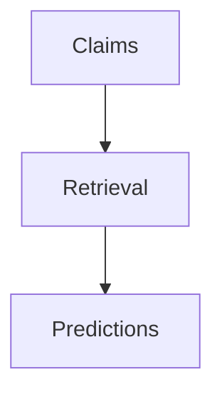

<h1 align="center"> Fact-Checking </h1>  

  Fact-checking is a process that seeks to verify factual information, to promote the veracity and correctness of reporting. Given a claim, we will want to check whether the claim is True, False or Not Enough Information with respect to the evidence that the claim is checked against.

## Table of Contents
- [Introduction](#introduction)
- [Webscraper](#Webscraper)
- [Training on VitaminC](#Training)
- [Finetuning on Politifact](#Finetuning)
- [Acknowledgments](#acknowledgments)

## Introduction
In this project, we are looking to improve upon a BERT-LSTM model used to predict True/False claims in the Singapore context. An example is highlighted in the table below. 

Claim  | Evidence | Label
------------- | ------------- | ---------------
Lee Hsien Loong is the prime minister of Singapore  | Lee Hsien Loong is the third and incumbent prime minister of Singapore |  True
COVID-19 and HIV viruses could combine and become another air-borne virus  | HIV and SARS-CoV-2 viruses are not related, and it is implausible in biological terms that these viruses can undergo genetic recombination |  False

The fact checking process consists of:
1) Generating claims
2) Retrieving relevant evidences given claim
3) Making a prediction given the retrieved evidences

Hence, in this project, we seek to improve both the *retrieval of evidences* and the *accuracy of predictions* with the BERT-LSTM model.
