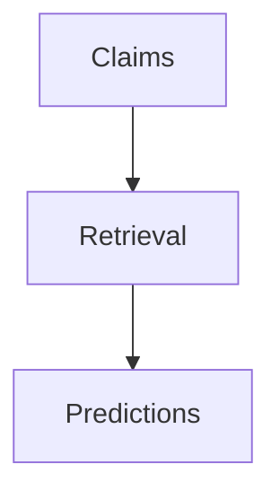

<h1 align="center"> Fact-Checking </h1>  

  Fact-checking is a process that seeks to verify factual information, to promote the veracity and correctness of reporting. Given a claim, we will want to check whether the claim is True, False or Not Enough Information with respect to the evidence that the claim is checked against.

## Table of Contents
- [Introduction](#introduction)
- [Claims](#Claims)
- [Webscraper](#Webscraper)
- [Training on VitaminC](#Training)
- [Finetuning on Politifact](#Finetuning)
- [Acknowledgments](#acknowledgments)

## Introduction
In this project, we are looking to improve upon a BERT-LSTM model used to predict True/False claims in the Singapore context. An example is highlighted in the table below. 

Claim  | Evidence | Label
------------- | ------------- | ---------------
Lee Hsien Loong is the prime minister of Singapore  | Lee Hsien Loong is the third and incumbent prime minister of Singapore |  True
COVID-19 and HIV viruses could combine and become another air-borne virus  | HIV and SARS-CoV-2 viruses are not related, and it is implausible in biological terms that these viruses can undergo genetic recombination |  False

The fact checking process consists of:
1) Generating claims
2) Retrieving relevant evidences given claim
3) Making a prediction given the retrieved evidences

Hence, in this project, we seek to improve both the ***retrieval of evidences*** and the ***accuracy of predictions*** with the BERT-LSTM model.

## Claims
A local test dataset was manually created consisting of 100 claims. The dataset is evenly distributed, with 55 True claims and 45 False claims.

## Webscraper 
The original webscraper used to retrieved relevant evidences given a claim is by using ***Google's crawler***. An example of the evidence snippets retrieved are as shown in the table below. 

Claim  | Retrieved Evidence | Improved Retieved Evidence | Gold Label
------------- | ------------- | --------------- | --------------
Covid-19 and hiv viruses could combine and become another air-borne virus | Dec 3, 2021 ... (i) The COVID-19 and HIV viruses could combine and become another air-borne ... to become an airborne HIV virus which is vaccine resistant. | In particular, there is currently no basis to conclude that: (i) The COVID-19 and HIV viruses could combine and become another air-borne virus; and (ii) Omicron is vaccine-resistant, and vaccines are totally useless against it. The COVID-19 and HIV viruses could combine in a fully vaccinated patient to become an airborne HIV virus which is vaccine resistant |  False

As seen, there are a few problems with the retrieved evidence, namely:
- It is ***incomplete***, as demarcated by the ellipses ('...') which gives the false impression that the evidence supports the claim. 
- The ***date data (Dec 3, 2021) is potentially noisy evidence*** that can affect the accuracy of model predictions

Hence, I first made use of regex to clean the noisy date data, before using the BeautifulSoup library to extract html data and perform substring search to complete the incomplete sentences. As seen under 'Improved retrieved evidence', the retrieved evidence is more complete and accurate in allowing us to arrive at the correct prediction. 

